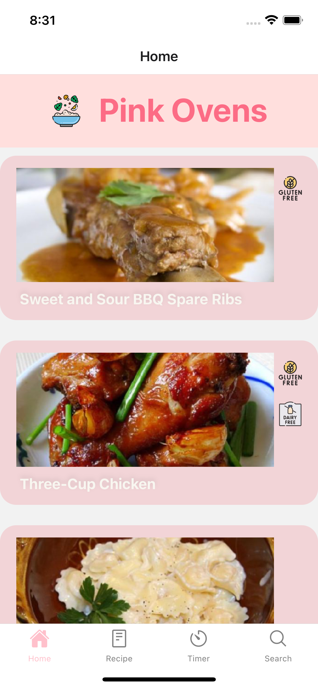
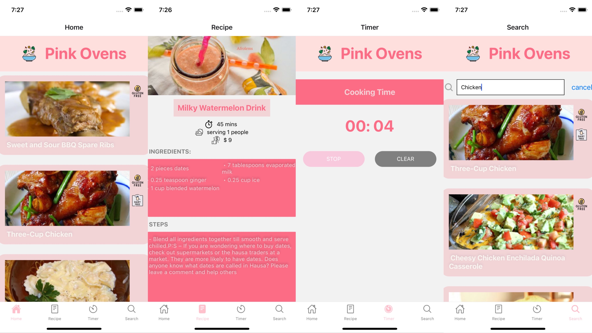

# Recipe App using React Native

# Instructions
After Downloading this from Github...

In order to run this mobile application on your device, you need to 
   1. Download your preferred software to test this app
   2. Set up the environment

# 1. Software Preparation
Device Choices for running the app:
   * Macbook
   * IOS device(iPhone)
   * Android device

## For Mac Users:
Please install the latest version of XCode.
#### Find it here: https://developer.apple.com/xcode/

## For IOS (iPhone) Users:
Please install the Expo Go from your App store
#### Find it here: https://apps.apple.com/us/app/expo-go/id982107779

## For Android Users:
Please install the Expo Go from your Google store
#### Find it here: https://play.google.com/store/apps/details?id=host.exp.exponent&referrer=www
Apology for the Android user, I do not have an Android device or so to test this. But it should be the same as iPhone to set up.

# 2. Get start/ Setup
To run this app:
### Change the directory to the RecipeApp
```cd RecipeApp```

### npm Install
```npm install```

### Run the App
```npx expo start```

#### Note: You can just ignore the warnings after running the app if they pop up.
#
#### After running the app, there will be a QR code and some instructions showing up in your terminal. You could either choose to 
* use a phone device scanning the QR code in the terminal with Expo Go for Android or Camera for IOS to allow the Expo Go running on your phone with this App. 
#### Or 
* press 'i' for the IOS iPhone simulator running in Xcode on your Macbook. 

#### Note: When I tested on my iPhone, it might take a minute or so to render all the recipe images on Home Screen since they are not local files.

#
Here is the home screen after bundling is done and everything works fine.



# Features:
- Home screen with a recipe list (name, image, etc)
- Recipe screen with a particular recipe showing after pressing from the home screen
- Timer screen with a simple runnable timer
- Search screen with a text input box searching for the name of the recipe you want.
- Tab navigator for switching between screens.




### Enjoy the recipes and this app, and I hope you like it! 😄
